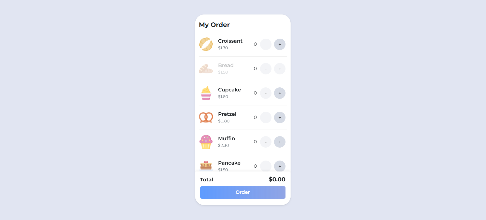
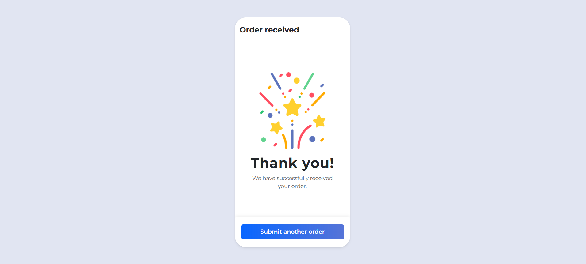

# A1G Frontend Challenge

A React TypeScript application for a bakery e-commerce platform, featuring product listing, cart management, and checkout functionality.

## User Interface

Here's a preview of the application's main interfaces:

### Home Page (Product Listing)

*Product catalog with dynamic cart management*

### Checkout Page

*Order summary and checkout process*

### Not Found Page

*Custom 404 error page*

## Architecture

### Tech Stack
- React 18 with TypeScript
- Vite for build tooling
- SCSS for styling
- React Query for state management
- React Router for navigation
- React Testing Library for testing

### Directory Structure
```
src/
├── app/              # App-level components and configuration
├── assets/           # Static assets (images, icons)
├── components/       # Reusable UI components
├── config/          # Configuration files and constants
├── features/        # Feature-based modules
├── hooks/           # Custom React hooks
├── lib/             # Third-party library wrappers
├── pages/           # Route pages
├── services/        # API and external service integrations
├── styles/          # Global styles and SCSS variables
├── types/           # TypeScript type definitions
└── utils/           # Utility functions
```

### Key Features
1. **Product Catalog**
   - Dynamic product listing
   - Virtual scrolling for performance

3. **Checkout Process**
   - Success confirmation
   - Error handling

### Routing Structure
- `/` - Home page (Product listing)
- `/checkout` - Checkout page
- `*` - 404 Not Found page

## Development

### Prerequisites
- Node.js 16+
- npm or yarn

### Setup
```bash
# Install dependencies
npm install

# Start development server
npm run dev

# Build for production
npm run build

# Run tests
npm run test
```

### Testing
- Unit tests with React Testing Library
- Integration tests for key features
- E2E testing capabilities
- Run `npm run test:coverage` for coverage report

### Code Quality
```bash
# Run linter
npm run lint

# Format code
npm run format

# Type check
npm run typecheck
```

## Documentation

- [Component Documentation](docs/components/README.md)
- [API Documentation](docs/api/README.md)
- [Testing Guide](docs/testing/README.md)
- [Style Guide](docs/style-guide/README.md)

## Performance Optimizations
- Code splitting with React.lazy
- Virtual scrolling for long lists
- Image optimization
- Memoization of expensive calculations

## Accessibility
- ARIA attributes
- Keyboard navigation
- Screen reader support
- Color contrast compliance

## Best Practices
- TypeScript for type safety
- Error boundaries for error handling
- Responsive design
- Clean code principles
- SOLID principles
- Component composition

## Improvements & Future Enhancements

### User Experience
- Add product search and filtering
- Implement product categories/tags
- Add user reviews and ratings
- Enhanced cart animations
- Save cart items in local storage
- Add wishlist functionality

### Performance
- Implement server-side rendering (SSR)
- Add service worker for offline support
- Implement progressive image loading
- Add Redis caching for API responses
- Optimize bundle size further

### Features
- User authentication/authorization
- Order history and tracking
- Multiple payment methods
- Product recommendations
- Email notifications
- Multi-language support

### Technical Improvements
- Implement GraphQL for better data fetching
- Add Storybook for component documentation
- Implement E2E tests with Cypress
- Add real-time updates with WebSocket
- Implement micro-frontend architecture
- Add CI/CD pipeline

### Analytics & Monitoring
- Add error tracking (e.g., Sentry)
- Implement analytics (e.g., Google Analytics)
- Add performance monitoring
- User behavior tracking
- A/B testing capability

## Contributing
1. Fork the repository
2. Create your feature branch
3. Commit your changes
4. Push to the branch
5. Create a pull request
